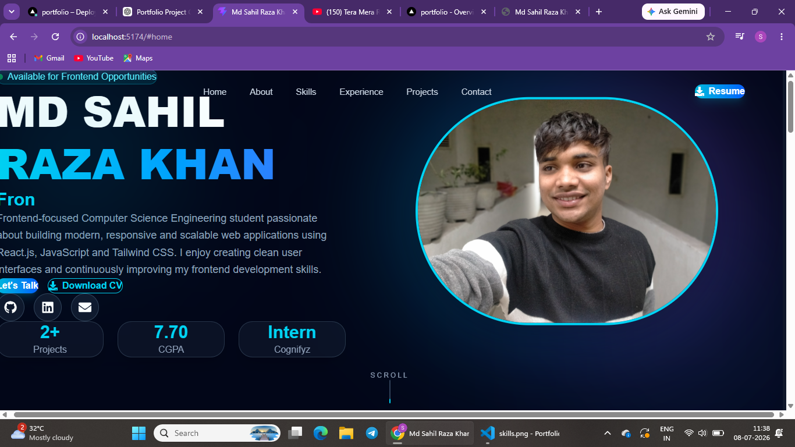
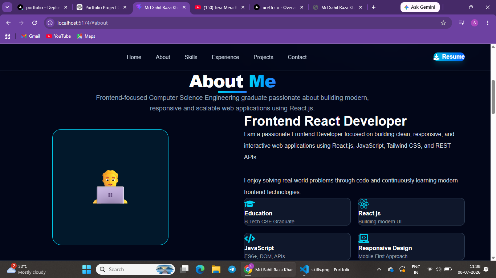
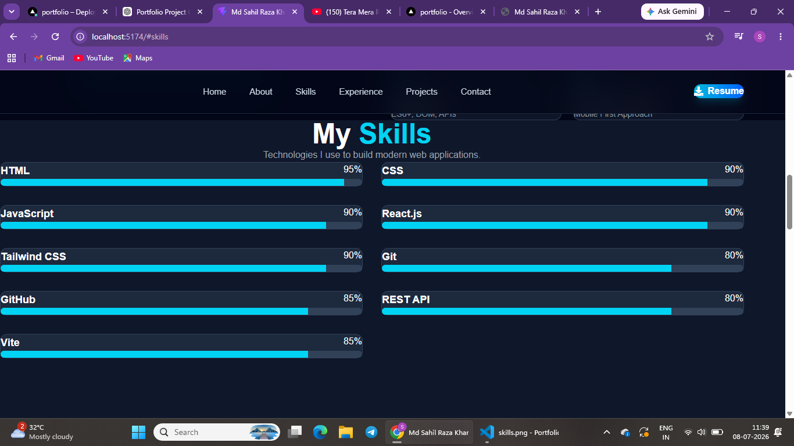
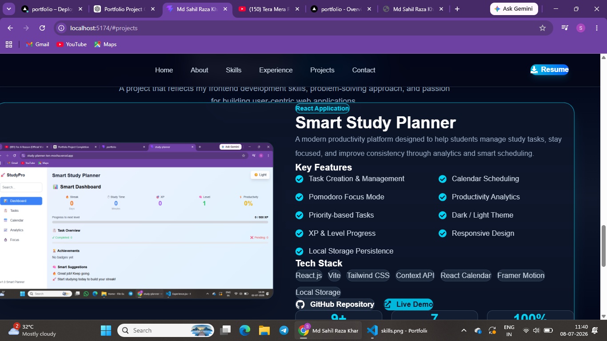
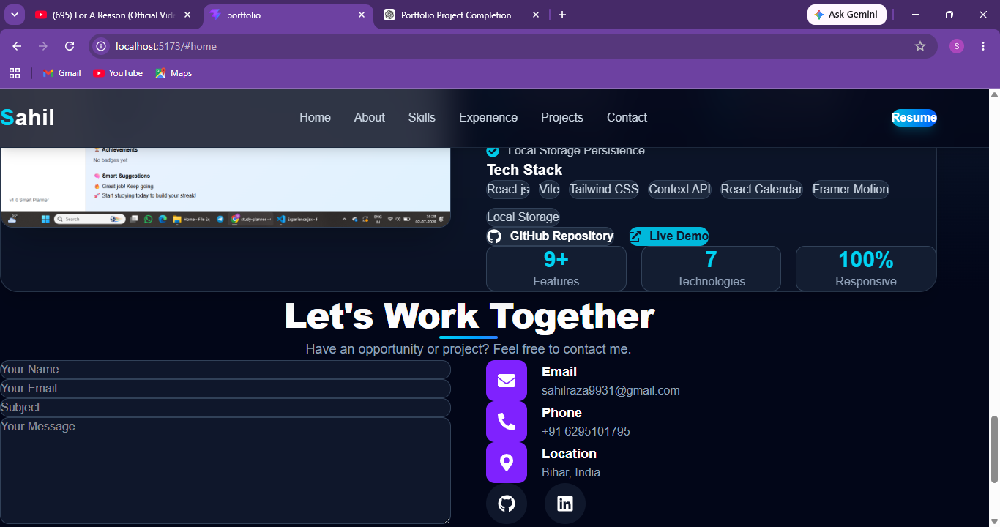

<div align="center">

# 🚀 Md Sahil Raza Khan

### Frontend React Developer

Building modern, responsive, and scalable web applications using **React.js**, **JavaScript**, and **Tailwind CSS**.

<br>

<a href="https://md-sahil-raza-portfolio.vercel.app/">
  
</a>

<a href="https://github.com/Sahil91029/Portfolio">
  
</a>

<a href="https://www.linkedin.com/in/md-sahil-raza-khan-1a544b3a9">
  
</a>

<a href="mailto:sahilraza9931@gmail.com">
  
</a>

</div>

---

# ✨ About This Project

This is my personal portfolio website built to showcase my **skills**, **projects**, **education**, and **experience** as a **Frontend React Developer**.

The portfolio focuses on **clean UI**, **responsive design**, **smooth animations**, and **reusable React components**, while following modern frontend development practices.

---

# 📸 Portfolio Preview

## 🏠 Hero Section



---

## 👨‍💻 About Section



---

## 🛠 Skills Section



---

## 🚀 Projects Section



---

## 📬 Contact Section



---

# ✨ Features

- 🎨 Premium Modern UI
- 📱 Fully Responsive Design
- ⚛️ React.js + Vite
- 🎭 Framer Motion Animations
- 💨 Tailwind CSS
- 🧩 Reusable Components
- 📊 Skills Progress Section
- 💼 Experience Timeline
- 🎓 Education Section
- 🚀 Featured Projects
- 📄 Resume Download
- 📧 Contact Form
- 🔗 GitHub & LinkedIn Integration

---

# 🛠 Tech Stack

<div align="center">


</div>

---

# 📂 Folder Structure

```text
Portfolio
│
├── public
│   └── resume.pdf
│
├── screenshots
│   ├── hero.png
│   ├── about.png
│   ├── skills.png
│   ├── projects.png
│   └── contact.png
│
├── src
│   ├── assets
│   ├── components
│   ├── data
│   ├── App.jsx
│   └── main.jsx
│
├── package.json
├── vite.config.js
└── README.md
```

---

# 🚀 Installation

Clone the repository

```bash
git clone https://github.com/Sahil91029/Portfolio.git
```

Move into the project

```bash
cd Portfolio
```

Install dependencies

```bash
npm install
```

Run locally

```bash
npm run dev
```

Create a production build

```bash
npm run build
```

---

# 📊 GitHub Stats

<p align="center">


</p>

---

# 🔥 GitHub Streak

<p align="center">


</p>

---

# 📈 Project Highlights

| Feature | Description |
|----------|-------------|
| ⚛️ Framework | React.js + Vite |
| 🎨 Styling | Tailwind CSS |
| 🎭 Animation | Framer Motion |
| 📱 Responsive | Mobile First Design |
| 🌙 Theme | Dark UI |
| 📄 Resume | Download Available |
| 🚀 Deployment | Vercel |

---

# 🎯 Future Improvements

- 🌐 Multi-language Support
- 📧 Functional Contact Form
- 🌙 Light / Dark Theme Toggle
- 📊 More Interactive Animations
- 📝 Blog Section
- ⚡ Performance Optimization

---

# 👨‍💻 About Me

Hi, I'm **Md Sahil Raza Khan**, a passionate **Frontend React Developer**.

I enjoy building clean, responsive, and user-friendly web applications using **React.js**, **JavaScript**, and **Tailwind CSS**.

I am currently looking for opportunities where I can contribute, learn, and grow as a Frontend Developer.

---

# 🤝 Connect With Me

<p align="center">

<a href="mailto:sahilraza9931@gmail.com">

</a>

<a href="https://www.linkedin.com/in/md-sahil-raza-khan-1a544b3a9">

</a>

<a href="https://github.com/Sahil91029">

</a>

</p>

---

# ⭐ Support

If you found this project helpful, consider giving it a ⭐ on GitHub.

It motivates me to build more useful and high-quality projects.

---

<div align="center">

### Built with ❤️ using React.js, Tailwind CSS & Framer Motion

</div>